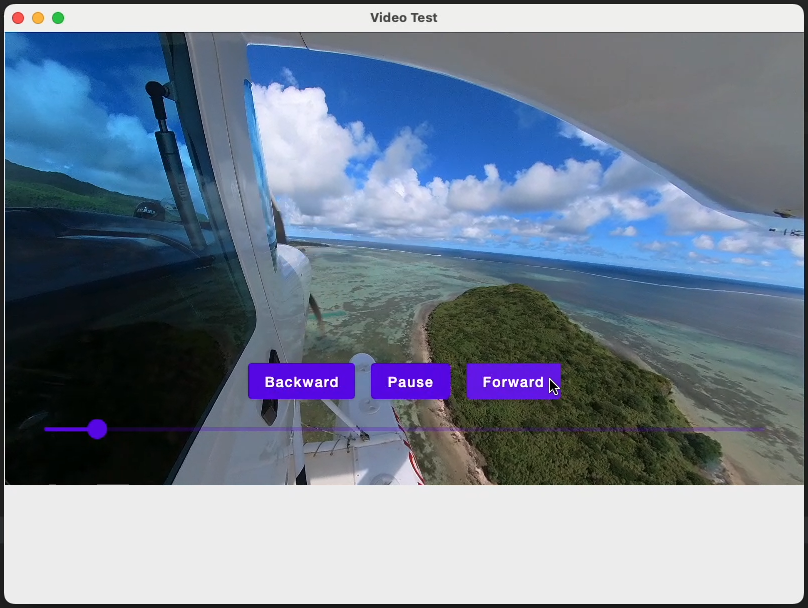

# ComposeVideoPlayer
VLCJ based video player for Jetpack Compose Desktop (no Swing Panel)

This approach uses VLCJ Direct Rendering (https://capricasoftware.co.uk/projects/vlcj-4/tutorials/direct-rendering) and a custom `CallbackVideoSurface`.

Useage:

```
    val videoPlayerState = rememberVideoPlayerState()
    VideoPlayer(
        mrl = "/Users/r.juszczyk/Movies/seaplane.mp4",
        state = videoPlayerState,
    )

    LaunchedEffect(videoFile) {
        videoPlayerState.doWithMediaPlayer { mediaPlayer ->
            mediaPlayer.addOnTimeChangedListener(
                object : OnTimeChangedListener {
                    override fun onTimeChanged(timeMillis: Long) {
                    }
                }
            )
        }
    }

    Button(
        onClick = {
            videoPlayerState.doWithMediaPlayer { mediaPlayer -> mediaPlayer.pause() }
        }
    ) {
        Text("Pause")
    }
```

Preview:

[](https://youtu.be/kAugr_j2wBE)

https://youtu.be/kAugr_j2wBE

